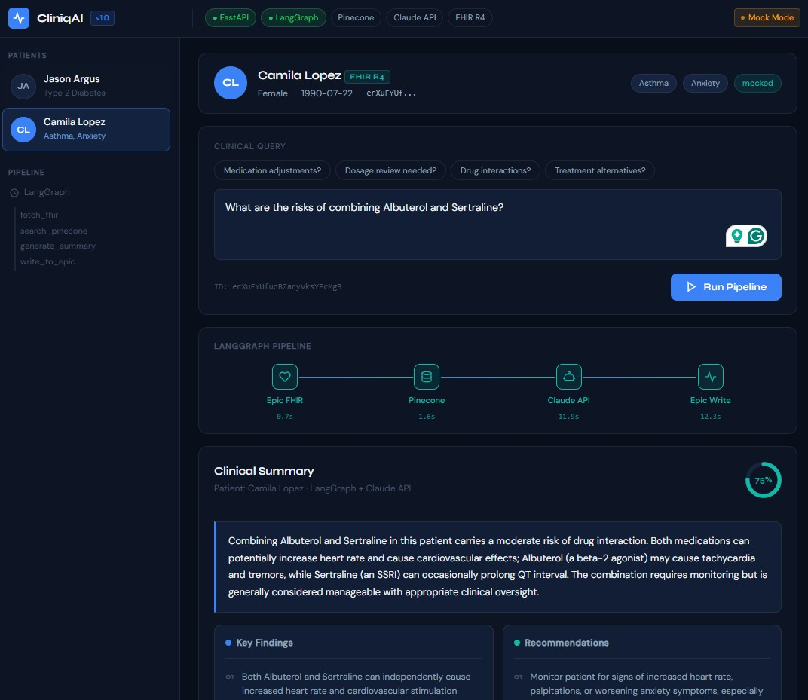
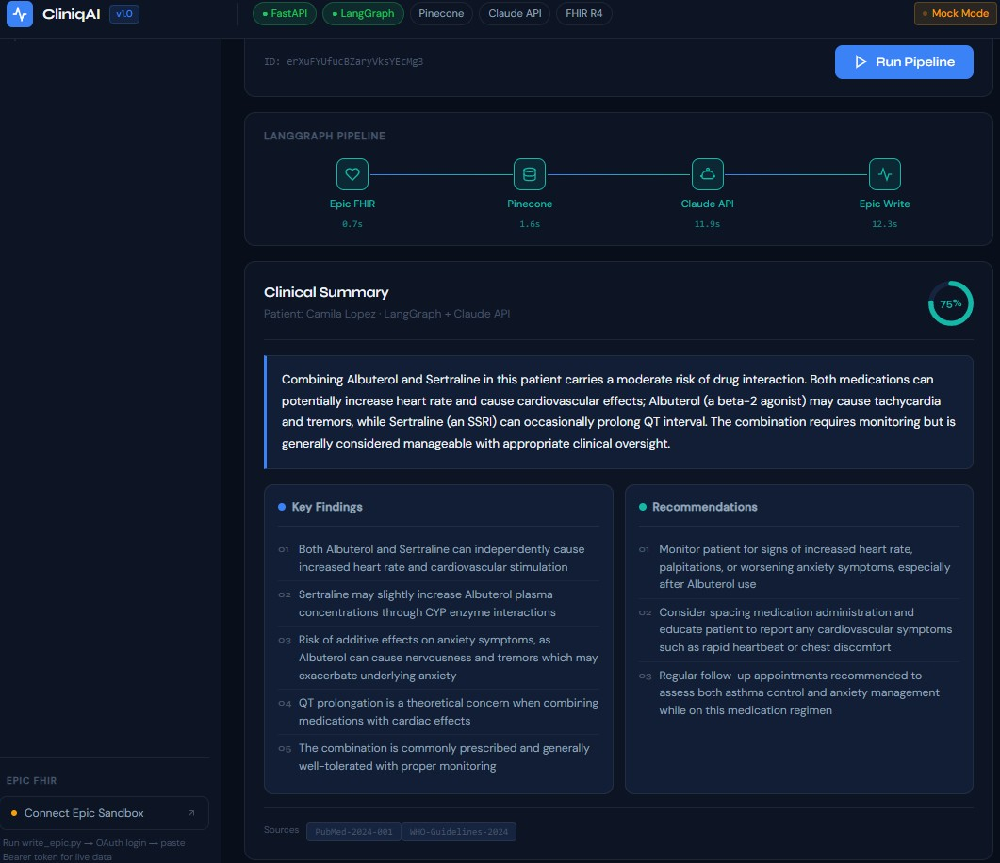

# CliniqAI — Healthcare RAG Platform

> Clinical decision support system powered by LangGraph, Epic FHIR R4, Pinecone, and Claude API.





> 🎬 [Watch Demo Video](static/images/demo-fhir.mp4)


---

## What It Does

A doctor types a clinical question. The system:

1. Fetches real patient data from **Epic FHIR R4** sandbox
2. Searches relevant **medical literature** via Pinecone vector search
3. Generates a **structured clinical summary** using Claude API tool use
4. Writes the AI-generated note **back to Epic** automatically

No keyword matching. No hallucinations. Structured output with confidence scoring.

---

## Pipeline Architecture

```
User Query
    ↓
fetch_fhir      →  Epic FHIR R4 sandbox (real patient data)
    ↓
search_pinecone →  Pinecone vector search (medical literature)
    ↓
generate_summary → Claude API tool use (structured JSON output)
    ↓
write_to_epic   →  DocumentReference pushed to Epic
```

Built with **LangGraph** — each step is a node with state management and memory checkpointing.

---

## Tech Stack

| Layer | Technology |
|---|---|
| Orchestration | LangGraph (StateGraph + MemorySaver) |
| LLM | Claude API (tool use — structured output) |
| Vector DB | Pinecone |
| Embeddings | HuggingFace MiniLM (384-dim) |
| EHR Integration | Epic FHIR R4 Sandbox |
| Backend | FastAPI |
| Auth | Epic OAuth 2.0 (SMART on FHIR) |

---

## Output Example

```json
{
  "summary": "Combining Albuterol and Sertraline carries moderate interaction risk...",
  "key_findings": [
    "Albuterol can cause tachycardia potentiated by Sertraline",
    "Both medications can lower serum potassium (hypokalemia)",
    "QT interval prolongation risk when combined"
  ],
  "recommendations": [
    "Monitor heart rate and blood pressure regularly",
    "Consider periodic ECG if cardiac risk factors present",
    "Counsel patient on symptoms to report"
  ],
  "confidence_score": 0.75,
  "sources_used": ["PubMed-2024-001", "WHO-Guidelines-2024"]
}
```

---

## Project Structure

```
healthcare-rag-platform/
├── main.py              # FastAPI app + /query endpoint
├── graph.py             # LangGraph pipeline (build_graph)
├── graph_state.py       # TypedDict state schema
├── nodes.py             # 4 pipeline nodes
├── fhir_client.py       # Epic FHIR R4 read + write
├── claude_client.py     # Claude API tool use
├── pinecone_client.py   # Pinecone vector search
├── models.py            # Pydantic models
├── write_epic.py        # Epic OAuth flow (standalone)
├── test_graph.py        # Full pipeline test
├── static/
│   └── index.html       # Frontend UI (CliniqAI)
└── .env.example
```

---

## Local Setup

**1. Clone**
```bash
git clone https://github.com/Samra-younas/healthcare-rag-platform
cd healthcare-rag-platform
```

**2. Install**
```bash
pip install -r requirements.txt
```

**3. Environment**
```bash
cp .env.example .env
```

Add your keys to `.env`:
```
ANTHROPIC_API_KEY=your-key
PINECONE_API_KEY=your-key
PINECONE_INDEX_NAME=healthcare-rag
HF_TOKEN=your-key
EPIC_CLIENT_ID=your-key
```

**4. Run**
```bash
uvicorn main:app --reload
```

Open: `http://127.0.0.1:8000`

---

## Test Pipeline

```bash
python test_graph.py
```

Expected output:
```
✅ FHIR Patient Context: Jason Argus — Type 2 Diabetes, Hypertension
✅ Pinecone Literature Context: [relevant chunks]
✅ Claude Summary: { structured clinical output }
```

---

## Epic FHIR — Live Mode

For real patient data (not mock):

```bash
python write_epic.py
```

1. Open `http://localhost:5000`
2. Login via Epic OAuth sandbox
3. Copy Bearer token
4. Add to `.env`: `EPIC_ACCESS_TOKEN=...`

FHIR endpoint: `fhir.epic.com/interconnect-fhir-oauth/api/FHIR/R4`

---

## Key Design Decisions

**Why LangGraph?** State management across 4 nodes with memory checkpointing — clean, debuggable, production-ready.

**Why Claude tool use?** Forces structured JSON output — no regex parsing, no hallucinated formats.

**Why mock mode?** Epic sandbox requires OAuth token per session. Mock mode mirrors exact same architecture — swap one function call for live data.

---

## Built By

**Samra Younas** — AI Engineer

[LinkedIn](https://linkedin.com/in/samra-younas-ai) · [Portfolio](https://samra.pythonanywhere.com) · [GitHub](https://github.com/Samra-younas)